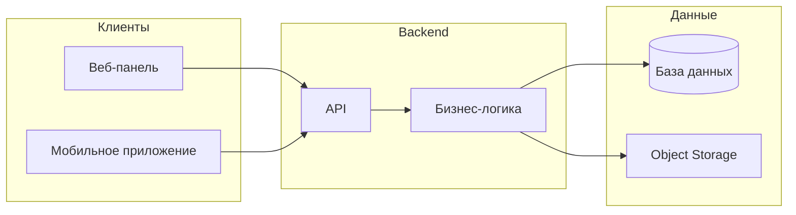
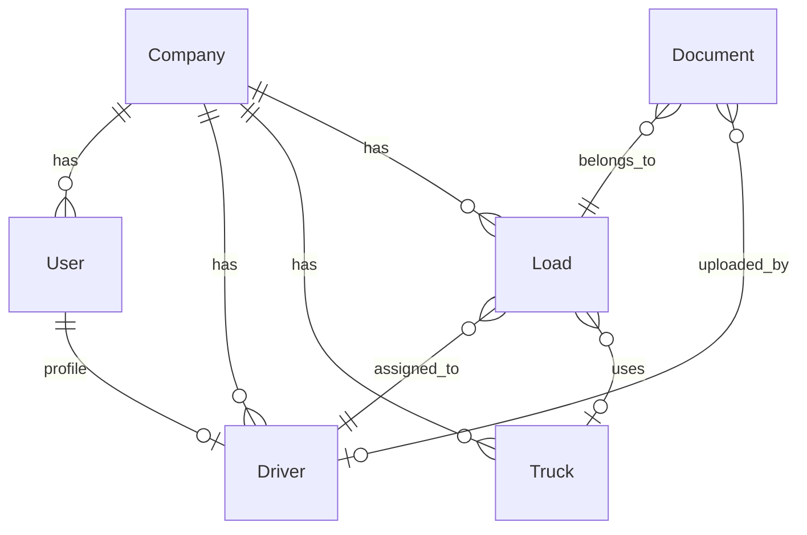

# TMS-USA
TMS-USA

# Платформа Transportation Management System (TMS)
## Lightpaper, продуктовая документация и описание системы

---

**Назначение документа:** презентация заказчику, объяснение архитектуры, описание этапов развития продукта, подготовка команды разработки.

---

## Содержание

1. [Общее описание платформы](#1-общее-описание-платформы)
2. [Проблемы отрасли грузоперевозок](#2-проблемы-отрасли-грузоперевозок)
3. [Видение платформы](#3-видение-платформы)
4. [Основные компоненты системы](#4-основные-компоненты-системы)
5. [Роли пользователей](#5-роли-пользователей)
6. [Основные функциональные модули](#6-основные-функциональные-модули)
7. [MVP платформы](#7-mvp-платформы)
8. [Этапы развития платформы](#8-этапы-развития-платформы)
9. [Архитектура системы](#9-архитектура-системы-высокоуровнево)
10. [Основные сущности данных](#10-основные-сущности-данных)
11. [Система управления документами](#11-система-управления-документами)
12. [Интеграции](#12-интеграции)
13. [Безопасность системы](#13-безопасность-системы)
14. [Масштабируемость](#14-масштабируемость)
15. [Потенциал развития платформы](#15-потенциал-развития-платформы)

---

## 1. Общее описание платформы

### 1.1. Что такое TMS

**Transportation Management System (TMS)** — система управления перевозками. Это единая цифровая среда для планирования, исполнения и контроля грузоперевозок. Платформа объединяет участников процесса: диспетчеров, водителей, менеджеров автопарка и операционный персонал — в одном информационном пространстве.

TMS не заменяет человека решениями, а даёт инструменты для быстрого доступа к данным, согласованных процессов и прозрачности операций. Всё необходимое для управления рейсом, водителями и документами доступно из веб-панели и мобильного приложения.

### 1.2. Какие задачи решает платформа

- **Планирование рейсов** — создание заявок на перевозку, маршруты, точки погрузки и выгрузки, сроки.
- **Назначение водителей и техники** — привязка рейса к водителю и транспортному средству, контроль загрузки.
- **Учёт документов** — хранение накладных (BOL), подтверждений доставки (POD), топливных чеков и других операционных документов в одном месте с привязкой к рейсу.
- **Диспетчеризация** — мониторинг статусов рейсов в реальном времени, оперативная связь и управление исключениями.
- **Управление автопарком** — учёт транспортных средств, водителей, ТО, допусков и топлива.
- **Отчётность и аналитика** — отчёты по рейсам, загрузке, расходам и KPI для принятия решений.

### 1.3. Для кого предназначена система

Платформа рассчитана на:

- **Транспортные компании** — перевозчики любого масштаба, которым нужен единый контур управления рейсами и документами.
- **Независимых дальнобойщиков** — водители, работающие на себя или с одним диспетчером; для них система даёт порядок в рейсах и документах.
- **Диспетчеров** — создание и редактирование рейсов, назначение водителей, контроль статусов без звонков и таблиц в Excel.
- **Менеджеров автопарка** — учёт техники, водителей, ремонтов и допусков в связке с рейсами.
- **Логистических операторов** — координация перевозок, документооборот и отчётность в одной платформе.

### 1.4. Ценность цифровизации

- **Сокращение ручного труда** — меньше звонков, переписок и дублирования данных; статусы и документы обновляются в системе.
- **Прозрачность операций** — в любой момент видно, на каком этапе рейс, какие документы загружены, кто назначен.
- **Быстрый доступ к документам** — поиск по рейсу, водителю или типу документа вместо поиска в почте и папках.
- **Основа для аналитики** — накопленные данные позволяют строить отчёты по рейсам, расходам и загрузке парка.
- **Масштабируемость** — один и тот же контур подходит для малого парка и для растущей компании при добавлении функций и интеграций.

Раздел ориентирован на нетехнических читателей: акцент на выгодах и решаемых задачах, без углубления в технологии.

---

## 2. Проблемы отрасли грузоперевозок

Современная отрасль грузоперевозок сталкивается с типичными проблемами, которые затрудняют контроль, масштабирование и снижение операционных рисков. Ниже перечислены основные из них и обоснование необходимости цифровых платформ.

### 2.1. Разрозненные документы

Накладные (BOL), подтверждения доставки (POD), топливные чеки и другие документы хранятся в разных форматах (бумага, фото, PDF, Excel) и в разных местах: у водителей, в почте, в папках на дисках. Поиск нужного документа к конкретному рейсу занимает время; при проверках и спорах сложно быстро представить полную картину. Нет единого реестра документов с привязкой к рейсу и дате.

### 2.2. Ручная работа диспетчеров

Диспетчеры тратят значительную часть времени на звонки, уточнение статусов, пересылку документов и дублирование данных в таблицах. Информация о рейсе размазана по переписке и памяти участников. При смене диспетчера или масштабировании штата преемственность и контроль усложняются. Автоматизации почти нет: статусы и документы не попадают в единую систему сами по себе.

### 2.3. Отсутствие централизованных систем

Многие компании по-прежнему опираются на разрозненные учёты: Excel, бумажные журналы, мессенджеры. Нет единого источника правды по рейсам, водителям и документам. Это ведёт к ошибкам, дублированию и невозможности быстро получить сводную картину для руководства и партнёров.

### 2.4. Сложность управления автопарком

Учёт транспортных средств, ремонтов, ТО, допусков и топлива часто ведётся отдельно от рейсов. Сложно понять, какая техника свободна, у какой заканчивается допуск или когда планировать обслуживание. Связь «рейс — водитель — машина» не формализована в одной системе.

### 2.5. Низкая прозрачность операций

Статус рейса и местоположение не всегда известны в реальном времени. Заказчики и руководство вынуждены запрашивать информацию у диспетчеров; водители не всегда оперативно обновляют статусы. Это снижает доверие и усложняет реакцию на сбои и задержки.

---

**Итог:** отрасли нужны современные цифровые платформы, которые централизуют рейсы, документы и автопарк, сокращают ручной труд и дают прозрачность и основу для аналитики. TMS как раз и закрывает эти потребности.

---

## 3. Видение платформы

### 3.1. Стратегический контекст

Платформа TMS рассматривается не как разовый набор функций, а как **цифровая логистическая инфраструктура** для управления перевозками. Цель — стать единым рабочим слоем, в котором планируются рейсы, назначаются водители, хранятся документы и ведётся учёт автопарка.

### 3.2. Ключевые идеи видения

- **Цифровая логистическая инфраструктура** — один согласованный слой данных и процессов для всех участников: диспетчеров, водителей, менеджеров автопарка и операционного персонала.
- **Централизованное управление перевозками** — рейсы, статусы, документы и назначения в одной системе с разграничением прав доступа и изоляцией данных по компаниям.
- **Масштабируемая платформа управления флотом** — от малого парка и независимых водителей до крупных перевозчиков и национальных логистических сетей за счёт настраиваемых модулей и архитектуры.
- **Интеграции с логистической экосистемой** — возможность подключения телематики, страховых и комплаенс-систем, логистических сервисов и партнёров для обмена данными и автоматизации.

Видение описывает направление развития без привязки к конкретным срокам и бюджетам.

---

## 4. Основные компоненты системы

Платформа состоит из пяти основных компонентов. Каждый имеет своё назначение и взаимодействует с остальными через единый backend и API.

### 4.1. Мобильное приложение водителя

**Назначение:** дать водителю инструмент для работы с рейсами и документами без необходимости звонить диспетчеру по каждому действию.

**Основные функции:**

- Просмотр назначенных рейсов, маршрутов и точек погрузки/выгрузки.
- Отметка статусов рейса (принят в работу, погрузка, в пути, выгрузка, завершён и т.д.).
- Загрузка документов: фото или файлы накладных (BOL), подтверждений доставки (POD), топливных чеков и других операционных документов с привязкой к рейсу.
- При необходимости — навигация и связь с диспетчером (чат, уведомления).

**Связь с системой:** приложение работает через API с backend; все изменения статусов и загруженные документы сразу доступны в веб-панели диспетчера и в учёте документов.

### 4.2. Веб-панель диспетчера

**Назначение:** основной рабочий инструмент диспетчера для планирования рейсов, назначения водителей и мониторинга.

**Основные функции:**

- Создание и редактирование рейсов: маршрут, даты, точки погрузки/выгрузки, параметры груза.
- Назначение водителей и при необходимости транспортных средств на рейсы.
- Просмотр списка и карты рейсов, фильтрация по статусу, дате, водителю.
- Просмотр загруженных документов по рейсам и водителям.
- Оперативная связь и уведомления (при развитии продукта).

**Связь с системой:** панель потребляет и отправляет данные через API; отображает в реальном времени статусы, обновлённые водителем в мобильном приложении.

### 4.3. Backend-сервисы

**Назначение:** обеспечить единую бизнес-логику, хранение данных и безопасный доступ для веб-панели и мобильного приложения.

**Основные функции:**

- REST или GraphQL API для всех операций: пользователи, рейсы, назначения, документы, справочники.
- Аутентификация и авторизация (учётные записи, роли, изоляция по компаниям).
- Валидация и оркестрация данных; при необходимости — очереди для тяжёлых задач (обработка файлов, отчёты).
- Подключение интеграций (телематика, внешние сервисы) на последующих этапах.

**Связь с системой:** backend — центральное звено: к нему обращаются веб и мобильное приложение; он управляет базой данных и файловым хранилищем.

### 4.4. Система хранения документов

**Назначение:** единое место для загрузки, хранения и поиска документов с привязкой к рейсам, водителям и компаниям.

**Основные функции:**

- Приём файлов (фото, PDF и др.) с мобильного приложения и веб-панели.
- Хранение в объектном хранилище; метаданные (тип документа, рейс, водитель, дата) — в базе данных.
- Версионирование при необходимости; ограничения по форматам и размеру файлов.
- Поиск и фильтрация по рейсу, водителю, типу документа, дате с учётом прав доступа.

**Связь с системой:** загрузка идёт через API backend; backend сохраняет файлы в хранилище и записывает метаданные в БД. Веб и приложение получают список документов и ссылки на просмотр/скачивание через API.

### 4.5. Аналитическая система

**Назначение:** агрегация данных о рейсах, автопарке и расходах для отчётов и принятия решений.

**Основные функции:**

- Агрегация данных по рейсам (количество, статусы, длительность), по водителям и технике, по расходам.
- Отчёты и дашборды: загрузка парка, выполнение рейсов, учёт расходов по категориям.
- KPI по перевозкам и при необходимости по компаниям/подразделениям.

**Связь с системой:** аналитика опирается на данные из той же БД и при необходимости на отдельные срезы или хранилище отчётности; доступ к отчётам через веб-панель с учётом ролей.

---

## 5. Роли пользователей

В системе предусмотрены роли с разным набором прав. Каждая роль соответствует типу пользователя и его типичным сценариям работы.

### 5.1. Водитель

**Описание:** пользователь, который выполняет рейсы и загружает документы с мобильного устройства.

**Права и функции:**

- Просмотр назначенных себе рейсов, маршрутов и заданий.
- Смена статуса рейса (принят, погрузка, в пути, выгрузка, завершён и т.д.).
- Загрузка документов (BOL, POD, чеки) с привязкой к рейсу.
- Просмотр своих загруженных документов и истории рейсов.
- При развитии продукта — уведомления и связь с диспетчером.

**Ограничения:** водитель не создаёт рейсы, не назначает других водителей и не видит данные других компаний или водителей.

### 5.2. Диспетчер

**Описание:** пользователь, который планирует рейсы, назначает водителей и контролирует исполнение.

**Права и функции:**

- Создание, редактирование и при необходимости отмена рейсов.
- Назначение водителей (и при наличии модуля — техники) на рейсы.
- Просмотр списка и карты рейсов, фильтрация по статусу, дате, водителю.
- Просмотр статусов рейсов в реальном времени и загруженных документов по рейсам и водителям.
- При развитии — шаблоны рейсов, массовые операции, уведомления.

**Ограничения:** диспетчер обычно не управляет справочником пользователей и глобальными настройками компании; при необходимости права ограничиваются своей зоной ответственности.

### 5.3. Менеджер автопарка

**Описание:** пользователь, ответственный за технику, водителей и их допуски.

**Права и функции:**

- Просмотр и при необходимости редактирование справочников транспортных средств и водителей.
- Учёт ТО, ремонтов, допусков и топлива (в рамках модуля управления автопарком).
- Связь рейсов с конкретными ТС и водителями; отчёты по загрузке парка и использованию техники.
- Просмотр документов и рейсов в контексте парка.

**Ограничения:** границы прав задаются политикой компании (например, только просмотр техники без редактирования рейсов).

### 5.4. Администратор

**Описание:** пользователь с максимальными правами в рамках своей компании (или платформы в single-tenant сценарии).

**Права и функции:**

- Управление пользователями: создание, редактирование, отключение учётных записей.
- Назначение и изменение ролей пользователей.
- Настройки компании: название, контакты, при необходимости параметры интеграций.
- При мультитенантной модели — изоляция данных компании; доступ только к своим данным.
- Включение/настройка интеграций (телематика, внешние системы) при их наличии.

**Ограничения:** в облачной мультитенантной платформе администратор не имеет доступа к данным других компаний и к инфраструктурным настройкам платформы.

### 5.5. Бухгалтерия / операционный персонал

**Описание:** пользователи, которым нужен доступ к документам и отчётности без права менять рейсы и назначения.

**Права и функции:**

- Просмотр и выгрузка документов (BOL, POD, чеки) по рейсам и периодам.
- Доступ к отчётам по рейсам, расходам и при необходимости к учёту расходов (в рамках выданных прав).
- Поиск документов по рейсу, водителю, типу, дате для закрытия рейсов и учёта.

**Ограничения:** нет прав на создание/редактирование рейсов, назначение водителей и управление пользователями; только просмотр и экспорт в рамках своей компании.

---

## 6. Основные функциональные модули

Ниже описаны ключевые функциональные модули платформы: назначение каждого и основные сценарии использования.

### 6.1. Операции водителей

**Назначение:** обеспечить водителю возможность принимать рейсы, обновлять статусы и загружать документы с телефона.

**Основные сценарии:**

- Водитель видит список назначенных рейсов и открывает нужный для просмотра деталей и маршрута.
- Отмечает переходы между этапами: принят в работу, начата погрузка, в пути, выгрузка, рейс завершён.
- Снимает фото или загружает файл накладной, POD, топливного чека и привязывает документ к рейсу.
- При необходимости — передача геолокации для отображения на карте диспетчера (при развитии и согласии пользователя).

### 6.2. Управление рейсами

**Назначение:** планирование и учёт рейсов: маршрут, даты, точки, груз, привязка к заказам при необходимости.

**Основные сценарии:**

- Создание рейса: точки погрузки и выгрузки, даты и время, описание груза, контакты.
- Редактирование рейса до момента назначения и при необходимости после (в рамках политики).
- Привязка рейса к заказу или грузу (при интеграции с учётными системами).
- Хранение истории изменений и статусов рейса.

### 6.3. Диспетчеризация

**Назначение:** назначение исполнителей и мониторинг исполнения в реальном времени.

**Основные сценарии:**

- Назначение водителя (и при наличии — ТС) на рейс; снятие назначения и переназначение.
- Просмотр текущих статусов всех рейсов в списке или на карте.
- Фильтрация по статусу, дате, водителю, клиенту для оперативного поиска.
- Реакция на исключения: задержки, смену маршрута, эскалации (уведомления, чат при развитии).

### 6.4. Управление автопарком

**Назначение:** учёт транспортных средств, водителей, ТО, допусков и топлива в связке с рейсами.

**Основные сценарии:**

- Ведение справочника ТС: госномер, марка, характеристики, привязка к компании.
- Справочник водителей: контакт, допуски, привязка к пользователю системы и компании.
- Учёт ТО и ремонтов: даты, пробег/моточасы, напоминания о следующих обслуживаниях.
- Учёт допусков и сроков их действия; предупреждения об истечении.
- Привязка рейса к конкретной машине и водителю; отчёты по загрузке парка.

### 6.5. Управление документами

**Назначение:** единое место хранения и поиска документов с привязкой к рейсам и водителям.

**Основные сценарии:**

- Загрузка документа с указанием типа (BOL, POD, топливный чек и т.д.) и привязкой к рейсу.
- Хранение файлов и метаданных; версионирование при необходимости.
- Поиск и фильтрация по рейсу, водителю, типу документа, дате.
- Скачивание и при необходимости экспорт списка документов по выбранным критериям.
- Разграничение доступа: пользователь видит только документы в рамках своих прав и своей компании.

### 6.6. Учёт расходов

**Назначение:** привязка расходов к рейсам и ТС для анализа себестоимости и отчётности.

**Основные сценарии:**

- Ввод расхода с указанием категории (топливо, ремонт, дороги, прочее), суммы, рейса и при необходимости ТС.
- Привязка топливных чеков к рейсу (документ уже в системе управления документами).
- Отчёты по расходам по рейсам, периодам, категориям и ТС.
- Использование данных для аналитики и расчёта себестоимости перевозок.

### 6.7. Аналитика перевозок

**Назначение:** агрегированные отчёты и KPI для оценки эффективности и загрузки.

**Основные сценарии:**

- Отчёты по количеству и статусам рейсов за период, по водителям и по клиентам/маршрутам.
- Показатели загрузки парка: использование ТС и водителей во времени.
- Анализ времени рейсов: длительность этапов, простои (при наличии данных).
- KPI: выполнение в срок, полнота документов, при необходимости — расходы на рейс.
- Дашборды с ключевыми метриками для руководства и операционных менеджеров.

---

## 7. MVP платформы

### 7.1. Цель MVP

Минимально жизнеспособная версия (MVP) предназначена для запуска работающего контура: **диспетчер создаёт рейс → назначает водителя → водитель выполняет рейс и обновляет статусы → загружает документы → диспетчер видит статус и документы в реальном времени.** Цель — проверить ценность продукта на реальных пользователях и получить обратную связь без реализации всего перечня функций.

### 7.2. В состав MVP входит

- **Мобильное приложение водителя:** список назначенных рейсов, просмотр деталей рейса, смена статуса рейса, загрузка документов (фото/файлы) с привязкой к рейсу.
- **Веб-панель диспетчера:** создание рейса (маршрут, даты, груз, точки погрузки/выгрузки), назначение водителя на рейс, просмотр списка рейсов и их статусов, просмотр загруженных по рейсам документов.
- **Базовый backend:** учёт пользователей и ролей (водитель, диспетчер, администратор), рейсы, назначения водителей, API для мобильного приложения и веб-панели.
- **Загрузка и хранение документов:** приём файлов с мобильного приложения и веб-панели, сохранение в хранилище, метаданные в БД, привязка к рейсу и водителю.
- **Отслеживание статуса рейса в реальном времени:** обновление статуса водителем в приложении и немедленное отображение в панели диспетчера (через обновление данных по API или при развитии — через обновление экрана/уведомление).

### 7.3. Вне MVP на первых этапах

Расширенная аналитика (дашборды, KPI), полный модуль управления автопарком (справочники ТС, ТО, допуски), учёт расходов, интеграции с телематикой и внешними системами, шаблоны рейсов и массовые операции — планируются на последующих этапах развития после стабилизации MVP и сбора обратной связи.

---

## 8. Этапы развития платформы

Развитие платформы описывается поэтапно. Этапы приведены в логическом порядке без привязки к срокам и датам.

### Этап 1 — Запуск базовой платформы

- Ввод в эксплуатацию MVP: мобильное приложение водителя, веб-панель диспетчера, создание рейсов, назначение водителей, загрузка документов, отображение статусов.
- Стабилизация работы, исправление ошибок и доработка удобства использования по обратной связи от первых пользователей.
- Формирование базовых процессов использования системы в компании.

### Этап 2 — Автоматизация операций

- Шаблоны рейсов для типовых маршрутов и заказчиков.
- Массовые операции: массовое назначение, массовое изменение статусов или дат в рамках прав доступа.
- Уведомления и напоминания: водителю о новом рейсе или необходимости загрузить документ; диспетчеру о смене статуса или просрочке.

### Этап 3 — Управление автопарком

- Справочники транспортных средств и водителей с привязкой к компании.
- Учёт ТО и допусков; напоминания о сроках.
- Связь рейса с конкретным ТС и водителем; отчёты по использованию парка.

### Этап 4 — Интеграции с логистической экосистемой

- Подключение телематических систем: координаты, топливо, моточасы для обогащения данных о рейсах и аналитики.
- Интеграции с логистическими сервисами: обмен заказами/рейсами и статусами (по требованиям заказчика).
- Интеграции со страховыми и комплаенс-системами при необходимости для отчётности и соответствия требованиям.

### Этап 5 — Расширенная аналитика и оптимизация

- Дашборды и KPI по рейсам, загрузке парка и расходам.
- Отчёты по себестоимости рейсов и использованию ресурсов.
- Основа для оптимизации маршрутов и планирования загрузки парка (расширенные сценарии и рекомендации при дальнейшем развитии).

---

## 9. Архитектура системы (высокоуровнево)

### 9.1. Общая схема

Платформа строится как облачное приложение: клиенты (веб и мобильное приложение) обращаются к единому API backend; backend управляет данными в базе и файлами в объектном хранилище.

### 9.2. Frontend

- **Веб-панель:** одностраничное приложение (SPA), работающее в браузере. Все действия выполняются через вызовы API к backend. Подходит для диспетчеров, менеджеров и администраторов.
- **Мобильное приложение:** нативное или кроссплатформенное (например, React Native, Flutter) для водителей. Взаимодействует с тем же API; для аутентификации используются токены с учётом мобильного сценария (хранение, обновление, выход).

### 9.3. Backend

- Сервис приложения (монолит или набор сервисов), в котором реализована бизнес-логика: пользователи, рейсы, назначения, документы, роли, изоляция по компаниям.
- API: REST и/или GraphQL как единая точка входа для веб и мобильного приложения. Рекомендуется версионирование API и описание контрактов (например, OpenAPI) для разработки и интеграций.

### 9.4. API

- Единый API для веб-панели и мобильного приложения.
- Аутентификация (например, JWT или OAuth 2.0), авторизация по ролям и привязке к компании.
- Версионирование (например, префикс версии в URL или заголовок) и документирование для упрощения поддержки и подключения интеграций.

### 9.5. Базы данных

- Реляционная СУБД для основных сущностей: пользователи, компании, водители, рейсы, назначения, метаданные документов. Транзакционность и целостность связей важны для операционных данных.
- При росте нагрузки — кэш (например, Redis) для сессий и частых запросов; очереди для фоновых задач (обработка файлов, формирование отчётов).

### 9.6. Хранение файлов

- Объектное хранилище (S3-совместимое) для файлов документов. Backend не хранит файлы на локальном диске; загрузка идёт через API, backend сохраняет файл в хранилище и записывает метаданные в БД.
- При необходимости раздачи файлов большому числу пользователей — CDN перед хранилищем.

---

## 10. Основные сущности данных

Ключевые сущности системы и связи между ними приведены ниже. Модель данных поддерживает многопользовательность и привязку всех операционных данных к компании.

### 10.1. Users

Учётные записи пользователей системы: логин, хэш пароля, роль, привязка к компании. Один пользователь может быть привязан к одной компании (в мультитенантной модели). Отдельно может храниться связь «пользователь — водитель» (профиль водителя), если водитель — это пользователь с ролью «водитель».

### 10.2. Companies

Организации (перевозчики, заказчики). В мультитенантной конфигурации все данные пользователей, водителей, техники и рейсов изолированы по компании: пользователь видит только данные своей компании.

### 10.3. Drivers

Профили водителей: ФИО, контакты, допуски, привязка к пользователю (User) и к компании (Company). На рейс назначается водитель (Driver); при необходимости с водителем связывается пользователь для входа в мобильное приложение.

### 10.4. Trucks

Транспортные средства: госномер, марка, характеристики, привязка к компании. На рейс может быть назначено конкретное ТС (на этапах с модулем автопарка). Учитываются ТО и допуски (отдельные сущности или поля в зависимости от модели).

### 10.5. Loads (рейсы / заявки)

Рейс (заявка на перевозку): маршрут, точки погрузки и выгрузки, даты, статус, описание груза. Связи: с компанией (владелец рейса), с водителем (Driver), с ТС (Truck) при наличии модуля автопарка. Документы привязываются к рейсу (Load).

### 10.6. Documents

Метаданные документа: тип (BOL, POD, топливный чек и т.д.), связь с рейсом (Load), с водителем (Driver), с компанией (Company), дата загрузки, идентификатор файла в объектном хранилище. Сам файл хранится в хранилище; в БД — только метаданные и ссылка.

### 10.7. Связи между сущностями

- **Company** — владелец **Users**, **Drivers**, **Trucks**, **Loads**; все они привязаны к одной компании.
- **Load** связан с **Driver** (назначенный водитель) и при наличии — с **Truck**.
- **Document** связан с **Load**, при необходимости с **Driver** и **Company**.
- **User** может быть связан с **Driver** (один пользователь — один профиль водителя в рамках компании).

---

## 11. Система управления документами

### 11.1. Типы документов

Система поддерживает основные типы операционных документов грузоперевозок:

- **BOL (Bill of Lading)** — накладная, подтверждающая приём груза к перевозке.
- **POD (Proof of Delivery)** — подтверждение доставки (подпись получателя, печать, фото).
- **Топливные чеки** — привязка к рейсу для учёта расходов на топливо.
- **Прочие операционные документы** — таможенные, коммерческие, акты и т.д. Классификация по типу и привязка к рейсу позволяют искать и фильтровать документы.

### 11.2. Загрузка

- **С мобильного приложения:** водитель снимает фото или выбирает файл, указывает тип документа и привязывает к текущему рейсу. Файл отправляется на API; backend валидирует формат и размер и сохраняет в хранилище.
- **С веб-панели:** диспетчер или другой пользователь с правами загружает файл, выбирает тип документа, рейс и при необходимости водителя. Те же ограничения по формату и размеру применяются на backend.

### 11.3. Хранение

- Файлы хранятся в объектном хранилище (S3-совместимом) с уникальными именами/путями; дублирование имён исключено.
- В базе данных хранятся метаданные: тип документа, рейс, водитель, компания, дата загрузки, идентификатор файла в хранилище, размер. Доступ к файлу выдаётся через API с проверкой прав: пользователь видит только документы своей компании и в рамках своей роли.

### 11.4. Поиск и доступ

- Поиск и фильтрация по рейсу, водителю, типу документа, дате загрузки. Список документов возвращается API с учётом прав доступа.
- Скачивание или просмотр файла — по ссылке/эндпоинту с проверкой прав и при необходимости временным токеном. Разграничение доступа обеспечивается ролями и привязкой данных к компании.

---

## 12. Интеграции

Платформа может взаимодействовать с внешними системами логистической экосистемы. Ниже описаны направления интеграций на уровне целей и типов данных, без детализации реализации.

### 12.1. Логистические сервисы

- Обмен заказами на перевозку и рейсами: приём заявок из внешней системы, передача статусов обратно.
- Синхронизация справочников (контрагенты, точки) при необходимости. Формат и протокол (REST, webhook, очередь сообщений) определяются на этапе проектирования интеграции.

### 12.2. Страховые системы

- Передача данных о рейсах и транспортных средствах для оформления полисов и отчётности.
- Получение статусов и требований от страховых систем при необходимости.

### 12.3. Телематические системы

- Получение данных о местоположении, топливе, моточасах для обогащения рейсов и аналитики.
- Отображение позиции ТС на карте в панели диспетчера; учёт топлива и пробега в отчётах.

### 12.4. Системы комплаенса

- Обмен данными для соответствия отраслевым и регуляторным требованиям (допуски, часы работы, вес/габариты и т.д.).
- Передача отчётных данных в форматах, требуемых регуляторами или партнёрами.

Конкретные протоколы, форматы и объём данных определяются на этапах внедрения интеграций.

---

## 13. Безопасность системы

### 13.1. Аутентификация

- Учётная запись с логином и надёжным паролем; пароли хранятся в виде криптографических хэшей, не в открытом виде.
- Для мобильного приложения — выдача и обновление токенов (например, JWT) с ограниченным сроком жизни; при необходимости — refresh-токены и безопасное хранение на устройстве.
- При необходимости — многофакторная аутентификация (MFA) для ролей с повышенными правами или по политике компании.

### 13.2. Управление доступом

- Ролевая модель (RBAC): права привязаны к ролям (водитель, диспетчер, менеджер автопарка, администратор, бухгалтерия/операционный персонал).
- Мультитенантность: изоляция данных по компаниям — пользователь видит и может изменять только данные своей компании. Проверка привязки к компании выполняется на уровне API и запросов к БД.

### 13.3. Защита данных

- Передача данных по защищённому каналу (TLS/HTTPS) для веб-панели и API.
- При необходимости — шифрование данных в покое (БД, хранилище файлов) в соответствии с политикой безопасности.
- Резервное копирование и политики хранения резервных копий для восстановления после сбоев.

### 13.4. Журналирование

- Логирование действий пользователей и критичных операций: вход/выход, создание и изменение рейсов, назначение водителей, загрузка и скачивание документов, изменение настроек и ролей.
- Журнал используется для аудита и расследования инцидентов; срок хранения логов задаётся политикой безопасности.

---

## 14. Масштабируемость

Система проектируется с учётом разного масштаба использования: от малого автопарка до крупных компаний и национальных логистических сетей.

### 14.1. Малый автопарк и независимые водители

- Один инстанс приложения и базы данных достаточно для десятков пользователей и сотен рейсов в месяц.
- Минимум интеграций; простая конфигурация. Развёртывание возможно на стандартных облачных ресурсах (один сервер приложения, управляемая БД, объектное хранилище).

### 14.2. Крупные компании

- Масштабирование backend по горизонтали: несколько инстансов приложения за балансировщиком нагрузки.
- Вынос тяжёлых задач в очереди и воркеры (обработка файлов, формирование отчётов), чтобы не блокировать основной API.
- Оптимизация запросов к БД, индексы, кэширование частых данных (например, справочники, текущие рейсы) для снижения нагрузки на БД.

### 14.3. Национальные логистические сети

- Мультитенантность с жёсткой изоляцией данных по компаниям и при необходимости по регионам.
- При росте объёма данных — репликация БД для чтения, шардирование по компаниям или регионам при необходимости.
- CDN и геораспределённые точки входа для раздачи файлов и API с низкой задержкой для пользователей в разных регионах.

Принципы описаны без привязки к конкретным технологиям; выбор стеков и облачных сервисов выполняется на этапе проектирования и реализации.

---

## 15. Потенциал развития платформы

Ниже перечислены направления развития платформы как продукта. Они носят характер возможностей и не являются обязательствами по срокам или объёму.

### 15.1. Маркетплейс грузов

- Площадка для размещения заявок на перевозку (грузов) и предложений подвижного состава со стороны перевозчиков и водителей.
- Может быть реализована как отдельный продукт или модуль поверх текущей TMS с единой аутентификацией и учётом.

### 15.2. Оптимизация маршрутов

- Расчёт маршрутов с учётом загрузки, времени и ограничений; интеграция с картографическими и телематическими сервисами.
- Рекомендации по объездам, пунктам заправки и отдыха для водителей.

### 15.3. Углублённая аналитика

- Прогнозы и тренды: загрузка парка, спрос по направлениям, сезонность.
- Себестоимость рейсов и анализ рентабельности по маршрутам и клиентам.
- Расширенные дашборды и отчёты для руководства и операционных подразделений.

### 15.4. Интеллектуальное управление флотом

- Предиктивное обслуживание: прогноз необходимости ТО и ремонтов по данным телематики и истории.
- Рекомендации по назначению водителей и ТС на рейсы с учётом загрузки, допусков и истории.
- Автоматизация рутинных решений: шаблоны назначений, автоматическое наполнение рейсов из заявок при выполнении условий.

---

*Конец документа.*
